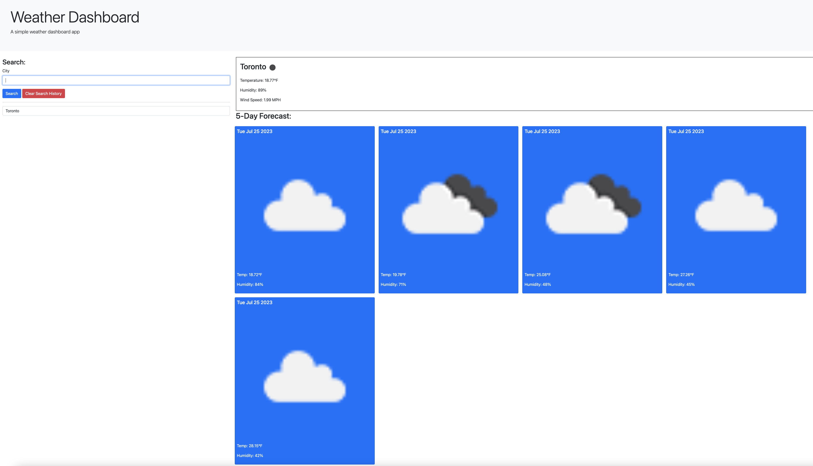

# Weather Forecast App - Module 6 
## Description

This is the module 6 challenge. In this challenge, I created a weather forecast app. A user of this weather app can search for local cities and get current and a 5-day forecast. The app allows the ability to store to local storage and clear local storage (search history)
## Live URL

Live URL Link: https://phillipkujawa.github.io/PhilWeatherDashboard---Module-6/

## Contributor

* @phillipkujawa

## License

MIT License
